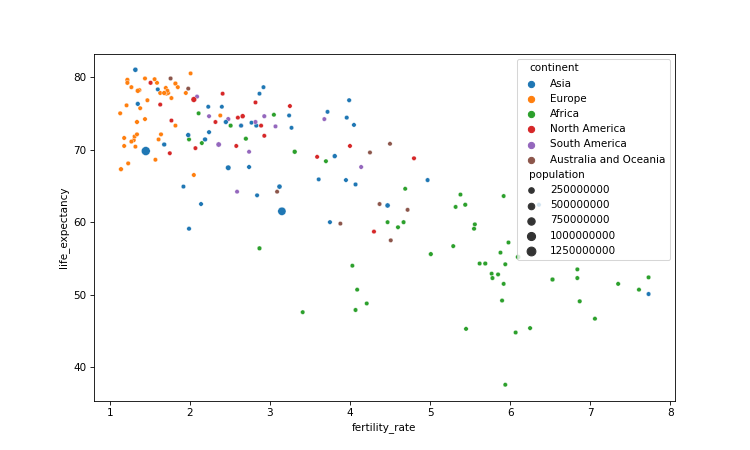
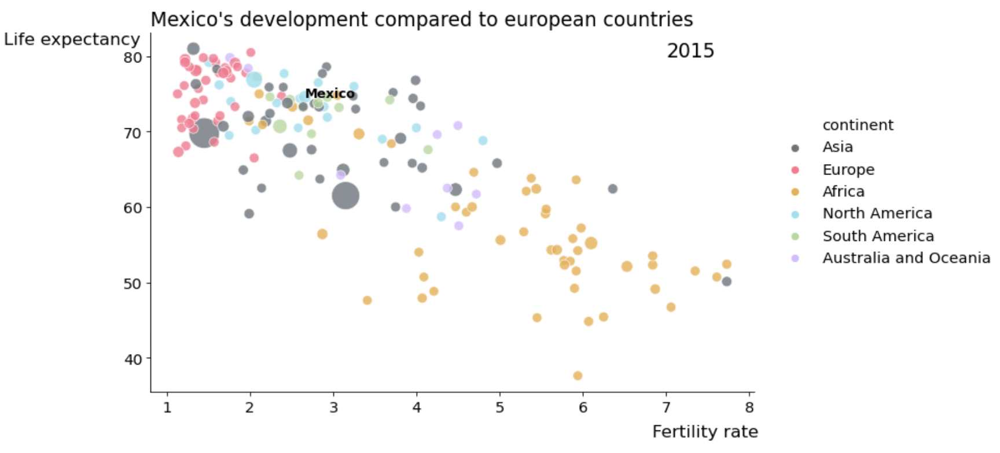

Best Practices in explanatory data visualization
==============

A step by step improvement of a standard seaborn plot following common explanatory data visualization best practices: 

- SIMPLIFY
- DRAW ATTENTION to your message (and separate from background)
- USE COLOR WITH INTENTION
- ANNOTATE
- CHOOSE THE RIGHT CHART

 All using seaborn and matplotlib. 

 *Before*

*After*

The notebook is derived from content originally designed for a Data Science encounter at [Spiced Academy](https://www.spiced-academy.com/en/program/data-science)

Licensed under [CC BY-SA 4.0](https://creativecommons.org/licenses/by-sa/4.0/)
